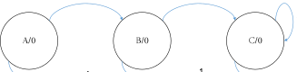
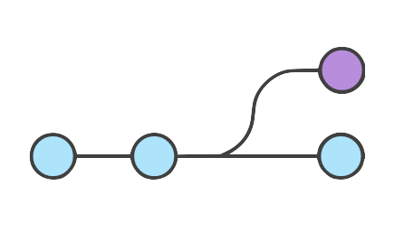

# [HoraProg'17](https://mluis.github.com/horaprog17)

SCV @ GIT

--

### [HoraProg17](https://mluis.github.com/horaprog17)

Pela prática, divulgação, promoção, desenvolvimento,
investigação e estudo das tecnologias,
técnicas ou ciências.

** sistema de controlo de versões (SCV) **

--

### Miguel Luís

* Autodidata
* "MacGyver" @ [LiveSense](http://livesense.com.au)
* R&D / DevOp - IoT M2M
* https://about.me/mluis

--

## Índice

1. SCV - Apresentação
2. SCV - Arquiteturas
3. SCV - Git
4. SCV - Exercício (GitHub)

----

## 1. SCV

--

## 1. SCV - Apresentação

**Propósito -** Histórico de Alterações
 
**Função -** Navegação e Operação sobre o **Propósito**
 
 
**SCV** Serve para navegar e atuar sobre o histórico de alterações.

--

## 2. SCV - Arquiteturas

   

**Centralizada -** Sincronização através de um único ponto

 

   

**Distribuída -** Sincronização através de multiplos pontos independentes

--

## 
## 3.0 SCV - Git

 

**git -** Sistema de Controlo de Versões
 
 
**Funcionamento**
 
+ **Local -** iniciar -> criar/alterar -> versionar
 
+ **Remoto -** copiar -> criar/alterar -> versionar -> submeter 

--

## 
## 3.1 SCV - Git

 

1. **iniciar** 
&nbsp;&nbsp;&nbsp; $ git init 
2. **copiar** 
&nbsp;&nbsp;&nbsp; $ git clone URL.git 
3. **criar ou alterar** 
4. **versionar** 
&nbsp;&nbsp;&nbsp; $ git add data/wsdate-#/ 
&nbsp;&nbsp;&nbsp; $ git commit -m "descrição da alteração" 
5. **submeter** 
&nbsp;&nbsp;&nbsp; $ git push 

--

## 
## 3.2 SCV - Git

   

**branch -** criação de uma divergência/ramo para alterações
  
1. **Local [master]** 
&nbsp;&nbsp;&nbsp; $ git branch NOME_BRANCH 
&nbsp;&nbsp;&nbsp; $ git checkout NOME_BRANCH 
&nbsp;&nbsp;&nbsp; * criar/modificar **e** versionar * 
&nbsp;&nbsp;&nbsp; $ checkout master 
&nbsp;&nbsp;&nbsp; $ git merge NOME_BRANCH 

--

## 
## 4 SCV - GitHub

 

1. **Registo**
 
2. **Login**
 
3. **Exercício** 

--